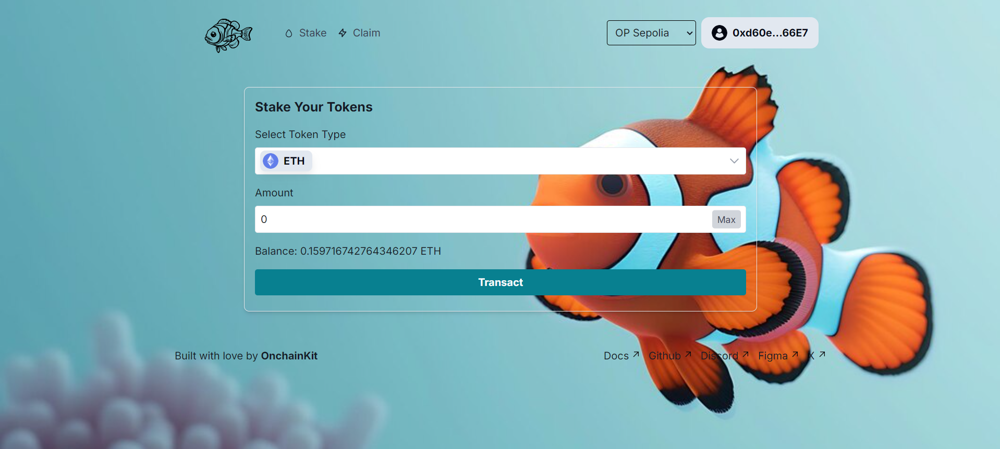
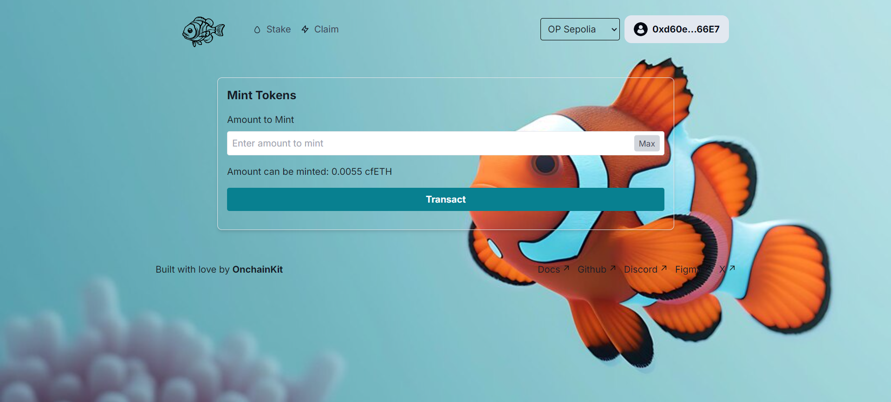
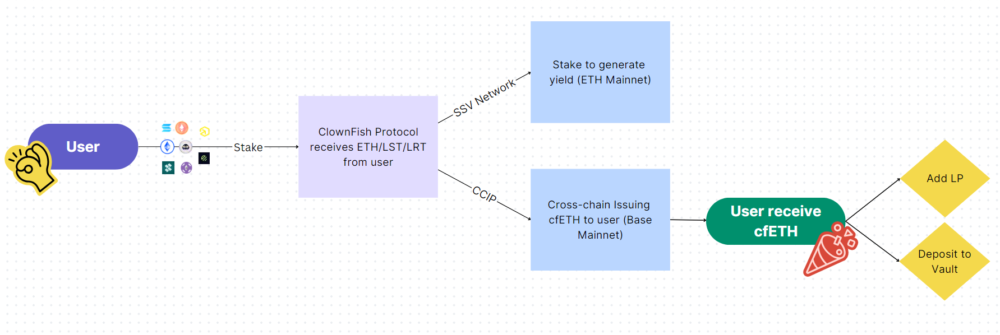
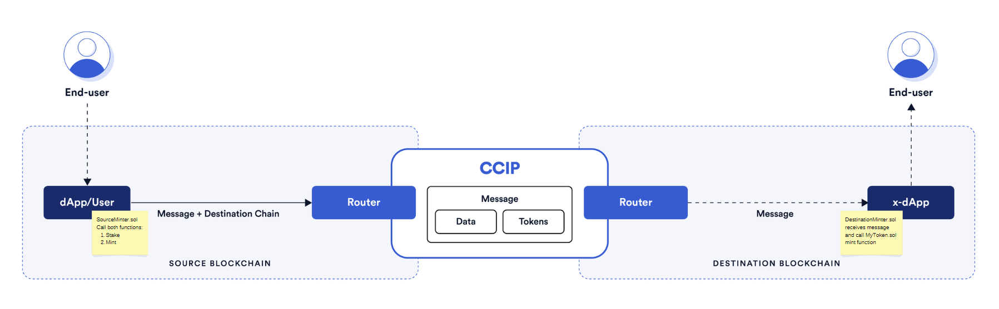
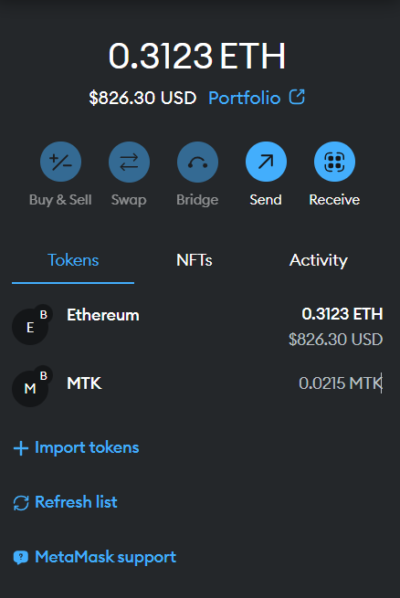

# ClownFish Protocol 🐠

🐠 Clownfish Protocol 🐠 is a cross-chain liquidity protocol that aggregates ETH, Liquid Staking Tokens (LST), and Liquid Restaking Tokens (LRT) from Ethereum Mainnet to produce yield. Simultaneously, we issues our ClownFish ETH (cfETH), a 1:1 pegged ETH token on the Base chain.

This protocol utilizes Chainlink's Cross-Chain Interoperability Protocol (CCIP) to allow seamless cross-chain transactions where users can choose to pay fees in either NATIVE (ETH) or LINK on the source chain (currently Ethereum Mainnet). Users do not need to pay destination chain fees (Base chain) for claims, thanks to Chainlink. 🐟

Screenshot of the frontend:



> **Note**
>
> _This repository contains 2 templates. One is Onchainkit App Template from Base and another one is cross-chain-nft-minter-example from Chainlink. It is provided for the sole purpose of Based Malaysia Hackathon. This repository is provided "AS IS" without warranties of any kind, has not been audited, and may be missing key checks or error handling to make the usage of the product more clear.

<br />

## Features

- Cross-chain Liquidity: Aggregate ETH, LST, and LRT on Ethereum Mainnet.

- Yield Generation: Generate yield from the staked assets on Ethereum Mainnet.

- 1:1 Pegged Tokens: Issue cfETH on Base chain as a liquidity staked token to ETH on Ethereum Mainnet.

- Chainlink CCIP Integration: Pay source chain fees in either ETH or LINK without worrying about destination chain fees.

- Seamless Cross-chain Operations: Users can stake on Ethereum Mainnet and mint cfETH on Base chain.

## How it works?

Current ETH mainnet is flooded with LST and LRT, creating a fragmented liquidity environment. ClownFish Protocol solves this by aggregating these tokens on Ethereum Mainnet, stake to generate yield and maintaining the liquidity by issuing a 1:1 pegged cfETH on the Base chain. Through our cross-chain minting mechanism, users can seamlessly move their liquidity across chains using Chainlink CCIP, with the flexibility to pay fees in either source chain in ETH or LINK, eliminating the complexity of managing cross-chain fees on the destination chain. The Protocol Architecure is shown below:



Below is the screenshot of the CCIP cross-chain cfETH minting mechanism:

The end-user calls the dApp (SourceMinter.sol). For cfETH, the end-user calls stake() and mint() functions. It is then passed to the CCIP router on Ethereum Mainnet. The CCIP router will send the message to the DestinationMinter.sol on Base chain. The DestinationMinter.sol will then call the mint() function of the MyToken.sol on Base chain and thus send the cfETH to the end-user.




## Why ClownFish Protocol?

Users can maintain exposure to:

- The native ETH return +

- LST/LRT staking rewards +

- Accrue points on their deposited LRTs (if any) +

- Receive ClownFish Point [CF] +

- Vaults (CeFi) or LP (DeFi) with high yield strategies

## Frontend Setup

To ensure all components work seamlessly, set the following environment variables in your `.env` file using `.env.local.example` as a reference.

You can find the API key on the [Coinbase Developer Portal's OnchainKit page](https://portal.cdp.coinbase.com/products/onchainkit). If you don't have an account, you will need to create one. 

You can find your Wallet Connector project ID at [Wallet Connect](https://cloud.walletconnect.com).

```sh
# See https://portal.cdp.coinbase.com/products/onchainkit
NEXT_PUBLIC_CDP_API_KEY="GET_FROM_COINBASE_DEVELOPER_PLATFORM"

# See https://cloud.walletconnect.com
NEXT_PUBLIC_WC_PROJECT_ID="GET_FROM_WALLET_CONNECT"
```
<br />

## Locally run

```sh
# Install bun in case you don't have it
curl -fsSL https://bun.sh/install | bash

# Install packages
bun i

# Run Next app
bun run dev
```
<br />

## Backend Setup

Verify installation by typing:

```shell
node -v
```

and

```shell
npm -v
```

## Getting Started

1. Install packages

```
npm install
```

2. Compile contracts

```
npx hardhat compile
```

3. Setup environment variables

PRIVATE_KEY=
ETHEREUM_SEPOLIA_RPC_URL=
OPTIMISM_SEPOLIA_RPC_URL=
ARBITRUM_SEPOLIA_RPC_URL=
~~AVALANCHE_FUJI_RPC_URL=~~
POLYGON_AMOY_RPC_URL=
~~BNB_CHAIN_TESTNET_RPC_URL=~~
BASE_SEPOLIA_RPC_URL=
~~KROMA_SEPOLIA_RPC_URL=~~
~~WEMIX_TESTNET_RPC_URL=~~
~~GNOSIS_CHIADO_RPC_URL=~~
~~CELO_ALFAJORES_RPC_URL=~~
ARBISCAN_API_KEY=
OPTIMISM_API_KEY=
BASESCAN_API_KEY=

I have commanded out several chains since Alchemy does not support them. If you are planning to use them, please uncomment them in hardhit.config.ts and utils.ts. I have change fork MyNFT.sol and change to MyToken.sol which represent ClownFish ETH (cfETH) ERC-20 token. I have also changed the SourceMinter.sol to have stake logic and mint cfETH on destination chain.

### Deployment

1. Deploy the [`MyToken.sol`](./contracts/cross-chain-nft-minter/MyToken.sol) and [`DestinationMinter.sol`](./contracts/cross-chain-nft-minter/DestinationMinter.sol) smart contracts to the **destination blockchain**, by running the `deploy-destination-minter` task:

```shell
npx hardhat deploy-destination-minter
--router <routerAddress> # Optional
(Example: npx hardhat deploy-destination-minter --network baseSepolia)
```

2. Deploy the [`SourceMinter.sol`](./contracts/cross-chain-nft-minter/SourceMinter.sol) smart contract to the **source blockchain**, by running the `deploy-source-minter` task:

```shell
npx hardhat deploy-source-minter
--router <routerAddress> # Optional
--link <linkTokenAddress> # Optional
(Example: npx hardhat deploy-source-minter --network optimismSepolia)
```

3. Don't forgot to verify all your 3 contracts:

- MyToken.sol:

```shell
npx hardhat verify 
--network <destination network>
--address <tokenAddress>
(Example: npx hardhat verify --network baseSepolia 0xF59508A66e48e5E4dBbDF13076fd99Da18A8B95B)
```

- DestinationMinter.sol:

```shell
npx hardhat verify 
--network <destination network>
--address <destinationMinterAddress>
--router <routerAddress>
--token <MyToken.sol tokenAddress>
(Example: npx hardhat verify --network baseSepolia 0xEF2F13cF6B7da9b3439c20844bd4483a88c50743 0xD3b06cEbF099CE7DA4AcCf578aaebFDBd6e88a93 0x0137FfAEBBd1d7a8f8e3d798d9166F9ec3240a01)
```

- SourceMinter.sol:

```shell
npx hardhat verify 
--network <source network>
--address <sourceMinterAddress>
--router <routerAddress>
--link <LINK TokenAddress>
(Example: npx hardhat verify --network optimismSepolia 0xFd9738619115cd4BcB8311597D5C3Df7eBf18488 0x114A20A10b43D4115e5aeef7345a1A71d2a60C57 0xE4aB69C077896252FAFBD49EFD26B5D171A32410)
```

### Fee Management

4. Fund the [`SourceMinter.sol`](./contracts/cross-chain-nft-minter/SourceMinter.sol) smart contract with tokens for CCIP fees.

- If you want to pay for CCIP fees in Native tokens:

  Open Metamask and fund your contract with Native tokens. For example, if you want to mint from Ethereum Sepolia to Avalanche Fuji, you can send 0.01 Sepolia ETH to the [`SourceMinter.sol`](./contracts/cross-chain-nft-minter/SourceMinter.sol) smart contract.

  Or, you can execute the `fill-sender` task, by running:

```shell
npx hardhat fill-sender
--sender-address <sourceMinterAddress>
--blockchain <blockchain>
--amount <amountToSend>
--pay-fees-in <Native>
```

For example, if you want to fund it with 0.01 Sepolia ETH, run:

```shell
npx hardhat fill-sender --sender-address <SOURCE_MINTER_ADDRESS> --blockchain ethereumSepolia --amount 10000000000000000 --pay-fees-in Native
(Example: npx hardhat fill-sender --sender-address 0xFd9738619115cd4BcB8311597D5C3Df7eBf18488 --blockchain optimismSepolia --amount 0.01 --pay-fees-in Native)
```

- If you want to pay for CCIP fees in LINK tokens:

  Open Metamask and fund your contract with LINK tokens. For example, if you want to mint from Ethereum Sepolia to Avalanche Fuji, you can send 0.001 Sepolia LINK to the [`SourceMinter.sol`](./contracts/cross-chain-nft-minter/SourceMinter.sol) smart contract.

  Or, you can execute the `fill-sender` task, by running:

```shell
npx hardhat fill-sender
--sender-address <sourceMinterAddress>
--blockchain <blockchain>
--amount <amountToSend>
--pay-fees-in <LINK>
```

For example, if you want to fund it with 0.001 Sepolia LINK, run:

```shell
npx hardhat fill-sender --sender-address <SOURCE_MINTER_ADDRESS> --blockchain ethereumSepolia --amount 1000000000000000 --pay-fees-in LINK
```

### Staking

5. Stake ETH/LST/LRT by calling the `stake()` function of the [`SourceMinter.sol`](./contracts/cross-chain-nft-minter/SourceMinter.sol) smart contract on the **source blockchain**. It will add the staked amount to the `stakedBalance`.

### Minting

6. Mint cfETH by calling the `mint()` function of the [`SourceMinter.sol`](./contracts/cross-chain-nft-minter/SourceMinter.sol) smart contract on the **source blockchain**. It will send the CCIP Cross-Chain Message with the ABI-encoded mint function signature from the [`MyToken.sol`](./contracts/cross-chain-nft-minter/MyToken.sol) smart contract. The [`DestinationMinter.sol`](./contracts/cross-chain-nft-minter/DestinationMinter.sol) smart contracts will receive the CCIP Cross-Chain Message with the ABI-encoded mint function signature as a payload and call the [`MyToken.sol`](./contracts/cross-chain-nft-minter/MyToken.sol) smart contract using it. The [`MyToken.sol`](./contracts/cross-chain-nft-minter/MyToken.sol) smart contract will then mint the new token to the `msg.sender` account from the `mint()` function of the [`SourceMinter.sol`](./contracts/cross-chain-nft-minter/SourceMinter.sol) smart contract, a.k.a to the account from which you will call the following command:

```shell
npx hardhat cross-chain-mint
--source-minter <sourceMinterAddress>
--source-blockchain <sourceBlockchain>
--destination-blockchain <destinationBlockchain>
--destination-minter <destinationMinterAddress>
--pay-fees-in <Native | LINK>
--amount <amountToMint>
```

For example, if you want to mint NFTs on Avalanche Fuji by sending requests from Ethereum Sepolia, run:

```shell
npx hardhat cross-chain-mint --source-minter <SOURCE_MINTER_ADDRESS> --source-blockchain ethereumSepolia --destination-blockchain avalancheFuji --destination-minter <DESTNATION_MINTER_ADDRESS> --pay-fees-in Native
(Example: npx hardhat cross-chain-mint --source-minter 0xFd9738619115cd4BcB8311597D5C3Df7eBf18488 --source-blockchain optimismSepolia --destination-minter 0xEF2F13cF6B7da9b3439c20844bd4483a88c50743 --destination-blockchain baseSepolia --pay-fees-in Native --amount 0.01)
```

The current frontend Mint page is not functioning. Please use the command to mint cfETH.

You will be receiving this message after calling the command:

```
ℹ️  Attempting to call the mint function of the SourceMinter.sol smart contract on the avalancheFuji from 0x58D09ecd499A1d6F2a0269f361Ee6DbbaBa44eF8 account
✅ Mint request sent, transaction hash: 0x9bab186a9312afc279e9faf7b3f173011434112e9eb370e83363b15a6b1b51e1
✅ You can now monitor the token transfer status via CCIP Explorer by searching for CCIP Message ID: 0x
✅ Task cross-chain-mint finished with the execution
```

Please go to [CCIP Explorer](https://ccip.chain.link//) to check the status of the CCIP Message. 

7. Once the CCIP message is finalized on the destination blockchain, you can add your switch your wallet to Destination Chain and import cfETH to your wallet. Attached is the screenshot of the Metamask wallet after importing cfETH (I am using MTK as symbol for testing):



8. You can always withdraw tokens for Chainlink CCIP fees from the [`SourceMinter.sol`](./contracts/cross-chain-nft-minter/SourceMinter.sol) smart contract using the `withdraw` task. Note that the `--token-address` flag is optional. If not provided, native coins will be withdrawn.

```shell
npx hardhat withdraw
--beneficiary <withdrawTo>
--blockchain <sourceMinterBlockchain>
--from <sourceMinterAddress>
--token-address <tokensToWithdraw> # Optional, if left empty native coins will be withdrawn
```

For example, to withdraw tokens previously sent for Chainlink CCIP fees, run:

```shell
npx hardhat withdraw --beneficiary <BENEFICIARY_ADDRESS> --blockchain ethereumSepolia --from <SOURCE_MINTER_ADDRESS>
```

or

```shell
npx hardhat withdraw --beneficiary <BENEFICIARY_ADDRESS> --blockchain ethereumSepolia --from <SOURCE_MINTER_ADDRESS> --token-address 0x779877A7B0D9E8603169DdbD7836e478b4624789
```

depending on whether you filled the [`SourceMinter.sol`](./contracts/cross-chain-nft-minter/SourceMinter.sol) contract with `Native` or `LINK` in step number 4.

## Resources

- [OnchainKit documentation](https://onchainkit.xyz)
- We use the [OnchainKit Early Adopter](https://github.com/neodaoist/onchainkit-early-adopter) contract written by neodaoist [[X]](https://x.com/neodaoist)
- [Chainlink CCIP](https://docs.chain.link/ccip/ccip-overview)
- Older branch of [ccip-cross-chain-nft](https://github.com/SkyYap/ccip-cross-chain-nft/tree/cross-chain-nft-minter-example)

<br />

## License

This project is licensed under the MIT License - see the [LICENSE](LICENSE) file for details.

## Further Improvement

- Combine Stake and Mint into one transaction to reduce the number of transactions and improve UX.
- Add more tests
- Fix claim page not functioning
- Improve contract security
